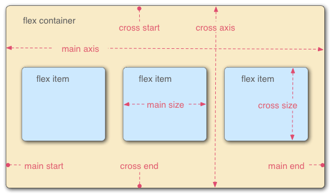

# stuq-wxapp：狼叔带你一起玩转微信应用号


主题：微信小程序开发适合你吗？

# 微信小程序是什么？

（从技术角度看，微信提供的框架、接口、开发方法）

微信小程序是限于微信提供的MINA框架提供的app开发便捷展示解决方案

# IDE


helper for https://github.com/gavinkwoe/weapp-ide-crack

第一批内测只有200个，所以大部分人都没办法弄到，但又想提前体验，怎么办呢？

先从 https://github.com/gavinkwoe/weapp-ide-crack 开始说起吧。

## gavinkwoe是谁？

gavinkwoe是郭虹宇，老郭以前在腾讯，后来出来在呼家楼那边创业，很棒的公司，他本人技术也是相当到位的，最早是beeframework，代码写的还是相当棒，这货对tcp和c也相当厉害，据说拿过专利。后来bee半火不火的，就搞了类似于css描述生成iOS页面的东西，之后react-native出来之后，貌似就转rn了。而且还带出了QFish这样的优秀小弟，很棒的。

总之，老郭有非常强大的iOS开发能力，所以这次破解微信开发工具也是有一定必然性的。

## 小助手：weide

https://github.com/i5ting/weide

它其实就为了简化安装破解而写的简单小程序。利用node模块和npm强大的机制，简化破解并提供实用辅助功能。特别简单，但还算实用。

## 安装小助手

```
$ [sudo] npm i -g weide
```

## 小助手用法

- 下载微信web开发者工具0.9(百度: https://pan.baidu.com/s/1pLxqFzH （密码: bwt9）) 位置 /Applications/微信web开发者工具.app/
- 下载微信web开发者工具0.7(百度: https://pan.baidu.com/s/1pLTKIqJ （密码: iswg）) 位置 /Applications/微信web开发者工具0.7.app/

如果开发工具安装目录是/Applications/微信web开发者工具.app/，无需配置，一条命令即可

```
$ weide
```

否则需要配置环境变量


mac

```
$ export WECHAT_IDE=/Applications/微信web开发者工具0.9.app/
$ weide
```

windows cmd

```
$ set WECHAT_IDE=/Applications/微信web开发者工具0.9.app/
$ weide
```

## 项目创建

用法部分来自老郭 http://www.geek-zoo.com

1. 运行『微信Web开发者工具』
2. 通过微信扫描二维码
3. 创建项目
  * AppID：随便填
  * 项目名称：随便填
  * 本地开发目录：选择一个目录
4. 点击「添加项目」
  * 此时如果出错，先退出再重进
  * 此时，能够看到项目列表了
5. 打开项目
6. 开始开发
7. Good luck

## 学习资料

* NoteDown版本
	* 框架入门
		* http://wxopen.notedown.cn/framework/MINA.html
	* 组件入门
		* http://wxopen.notedown.cn/component/
	* API入门
		* http://wxopen.notedown.cn/api/

## Demo运行

* 创建项目
* 打开项目所在目录
* 下载「Demo源代码」并解压覆盖
* 打开项目
* Good luck

## 常见问题

1. 找不到所要替换的文件
  * 问题原因：开发工具版本不正确，老版本不支持
  * 解决方案：确保下载的程序版本在0.9.092100以上
2. Failed to load resource: net::ERR_NAME_NOT_RESOLVED http://1709827360.appservice.open.weixin.qq.com/appservice
  * 问题原因：通常是由于系统设置了代理如Shadowsocks等。
  * 解决方案：关闭代理，或者依次点击工具栏“动作”-"设置"，选择“不使用任何代理，勾选后直连网络”。
3. 修复asdebug.js报错
  * 问题原因：TypeError: Cannot read property 'MaxRequestConcurrent' of undefined
  * 解决方案：替换 /Resources/app.nw/app/dist/weapp/appservice/asdebug.js  
4. 扫码登录失败
  * 问题原因：please bind your wechat account to the appid first
  * 解决方案：先使用0.7版本的进行扫码登陆，登陆成功后，再用0.9的版本打开就直接进入了。
    * 0.7版本地址：http://dldir1.qq.com/WechatWebDev/release/0.7.0/wechat_web_devtools_0.7.0.dmg
5. mac版本升级到0.9.092300后，asdebug.js报错
  * 问题原因：TypeError: Cannot read property 'MaxRequestConcurrent' of undefined
  * 解决方案：替换 /Resources/app.nw/app/dist/weapp/appservice/asdebug.js  

## 工具截图


## 禁用自动升级

破解之后，微信官方立马2个通宵，修复了大量问题，包括store命名错误，自动升级。可以说之前的版本是没有被特意“保护”的，所以可以挖出更多细节，nw.js的升级机制很简单，非常容易破解

```
$ wecrack
```

会修改Contents/Resources/app.nw/package.json的版本号，避免自动升级

## 一键美化压缩js代码

会读取默认安装位置，或环境变量里的WECHAT_IDE下的所有js都会美化

```
$ allb
```

## 调试

```
$ DEBUG=weide weide
```


# 实例：用cnode社区api做微信小应用


https://github.com/coolfishstudio/wechat-webapp-cnode

## 导入项目

添加项目


选择源码所在目录


完整信息


## 首页

效果

### 布局


example/pages/topics/topics.wxml

```
<!--posts.wxml-->
<view class="topics-main">
  <view class="top-bar">
    <view class="top-bar-item" id="all" catchtap="onTapTag">全部</view>
    <view class="top-bar-item" id="good" catchtap="onTapTag">精华</view>
    <view class="top-bar-item" id="share" catchtap="onTapTag">分享</view>
    <view class="top-bar-item" id="ask" catchtap="onTapTag">问答</view>
    <view class="top-bar-item" id="job" catchtap="onTapTag">招聘</view>
  </view>
  <scroll-view class="posts-list" style="height:100%" scroll-y="true" bindscrolltolower="lower">
    <block wx:for="{{postsList}}">
      <view class="posts-item" index="{{index}}" id="{{item.id}}" catchtap="redictDetail">
        <view class="author">
          <image class="author-avatar" src="{{item.author.avatar_url}}"></image>
          <view class="author-name">{{item.author.loginname}}</view>
          <view class="posts-tag hot" wx:if="{{item.top === true}}">置顶</view>
          <view class="posts-tag" wx:if="{{item.good === true}}">精华</view>
          <view class="posts-last-reply">{{item.last_reply_at}}</view>
        </view>
        <view class="posts-title">{{item.title}}</view>
        <view class="bar-info">
          <view class="bar-info-item">
            <image class="bar-info-item-icon" src="/images/icon/reply.png"></image>
            <view class="bar-info-item-number">{{item.reply_count}}</view>
          </view>
          <view class="bar-info-item">
            <image class="bar-info-item-icon" src="/images/icon/visit.png"></image>
            <view class="bar-info-item-number">{{item.visit_count}}</view>
          </view>
        </view>
      </view>
    </block>
  </scroll-view>

  <loading hidden="{{hidden}}">
    加载中...
  </loading>
</view>
```

三大部分

- top-bar   分类是普通的view
- posts-list  帖子列表，是scroll-view
- loading  内置的组件，默认隐藏

> 简单点说，就是你们误会了的组件

是不是跟vue、react很像？

http://wxopen.notedown.cn/component/


### 帖子列表

```
  <scroll-view class="posts-list" style="height:100%" scroll-y="true" bindscrolltolower="lower">
    <block wx:for="{{postsList}}">
      <view class="posts-item" index="{{index}}" id="{{item.id}}" catchtap="redictDetail">
        <view class="author">
          <image class="author-avatar" src="{{item.author.avatar_url}}"></image>
          <view class="author-name">{{item.author.loginname}}</view>
          <view class="posts-tag hot" wx:if="{{item.top === true}}">置顶</view>
          <view class="posts-tag" wx:if="{{item.good === true}}">精华</view>
          <view class="posts-last-reply">{{item.last_reply_at}}</view>
        </view>
        <view class="posts-title">{{item.title}}</view>
        <view class="bar-info">
          <view class="bar-info-item">
            <image class="bar-info-item-icon" src="/images/icon/reply.png"></image>
            <view class="bar-info-item-number">{{item.reply_count}}</view>
          </view>
          <view class="bar-info-item">
            <image class="bar-info-item-icon" src="/images/icon/visit.png"></image>
            <view class="bar-info-item-number">{{item.visit_count}}</view>
          </view>
        </view>
      </view>
    </block>
  </scroll-view>
```

布局是scroll-view，然后嵌入了

```
<block wx:for="{{postsList}}">
  
</block>
```

像不像ejs里的

```
<ul>
<% for(var i=0; i<supplies.length; i++) {%>
   <li><%= supplies[i] %></li>
<% } %>
</ul>
```

然后我们看看里面的单条展示


```
      <view class="posts-item" index="{{index}}" id="{{item.id}}" catchtap="redictDetail">
        <view class="author">
          <image class="author-avatar" src="{{item.author.avatar_url}}"></image>
          <view class="author-name">{{item.author.loginname}}</view>
          <view class="posts-tag hot" wx:if="{{item.top === true}}">置顶</view>
          <view class="posts-tag" wx:if="{{item.good === true}}">精华</view>
          <view class="posts-last-reply">{{item.last_reply_at}}</view>
        </view>
        <view class="posts-title">{{item.title}}</view>
        <view class="bar-info">
          <view class="bar-info-item">
            <image class="bar-info-item-icon" src="/images/icon/reply.png"></image>
            <view class="bar-info-item-number">{{item.reply_count}}</view>
          </view>
          <view class="bar-info-item">
            <image class="bar-info-item-icon" src="/images/icon/visit.png"></image>
            <view class="bar-info-item-number">{{item.visit_count}}</view>
          </view>
        </view>
      </view>
```


可以看出是一个cell里分了3行

- 第1行 author   作者、时间
- 第2行 posts-title 标题
- 第3行 bar-info 评论，查看次数

然后单行，以author为例子

```
        <view class="author">
          <image class="author-avatar" src="{{item.author.avatar_url}}"></image>
          <view class="author-name">{{item.author.loginname}}</view>
          <view class="posts-tag hot" wx:if="{{item.top === true}}">置顶</view>
          <view class="posts-tag" wx:if="{{item.good === true}}">精华</view>
          <view class="posts-last-reply">{{item.last_reply_at}}</view>
        </view>
```

各位看到这里有啥感觉呢？

### 如何获取数据？

上面模板里的`for` + 描述用的block，有一个postsList，如果有它就可以显示了。那么如何它在哪里呢？

其实在example/pages/topics/topics.js里的

```
Page({
  data: {
    title: '话题列表',
    postsList: [],
    hidden: false,
    page: 1,
    tab: 'all'
  },
  ...
})
```

注意data里的postsList。也就是说data里的面内容会和模板一起编译，有木有明白点什么？

### 和模板引擎像么？

模板引擎原理

> 编译（模板 + 数据）= html

你只要setData,它就会自动渲染，是不是有点像mvvm？$scope?

```
        self.setData({
          postsList: self.data.postsList.concat(res.data.data.map(function (item) {
            item.last_reply_at = util.getDateDiff(new Date(item.last_reply_at));
            return item;
          }))
        });
```

只不过所有的数据都放到data作为上下文，这其实是简化了的方案。

### http请求

api是获取主页列表


具体的调用wx.request向服务器发送

```
    wx.request({
      url: Api.getTopics(data),
      success: function (res) {
        self.setData({
          postsList: self.data.postsList.concat(res.data.data.map(function (item) {
            item.last_reply_at = util.getDateDiff(new Date(item.last_reply_at));
            return item;
          }))
        });
        setTimeout(function () {
          self.setData({
            hidden: true
          });
        }, 300);
      }
    });
```

这里很简单

- get请求
- url = Api.getTopics(data)
- success 是当请求成功的时候的回调处理

和ajax基本一样，对比$.ajax，想想


更多示例

```
wx.request({
  url: 'test.php',
  data: {
     x: '' ,
     y: ''
  },
  header:{
      "Content-Type":"application/json"
  },
  success: function(res) {
     var data = res.data;
  }
});
```

剩下的我们还需要啥呢？

> 后台接口api开发就够了

### 你所说的mvvm呢？

### Page的生命周期

### tab


### 上拉加载下一页

所有的组件能和object是一样，就2各种：属性（基本类型，Boolean，Number，String）和行为（EventHandle）

```
 <scroll-view class="posts-list" style="height:100%" scroll-y="true" bindscrolltolower="lower">
```

这里的class，style，scroll-y，bindscrolltolower都是属性，唯一不一样的是bindscrolltolower，它实际上是行为

```
bindscrolltolower	EventHandle		滚动到底部/右边，会触发scrolltolower事件
```

即我们在移动端常说的上拉加载更多。

这和我们写react、vue实际上是非常类似的。

https://github.com/airyland/vux/blob/master/src/components/panel/index.vue

```
<template>
  <div class="weui_panel weui_panel_access">
    <div class="weui_panel_hd" v-if="header" @click="onClickHeader" v-html="header"></div>
    <div class="weui_panel_bd">
      <!--type==='1'-->
      <a :href="getUrl(item.url)" v-for="item in list" @click.prevent="onItemClick(item)" class="weui_media_box weui_media_appmsg" v-if="type === '1'">
        <div class="weui_media_hd" v-if="item.src">
          
        </div>
        <div class="weui_media_bd">
          <h4 class="weui_media_title">{{item.title}}</h4>
          <p class="weui_media_desc">{{item.desc}}</p>
        </div>
      </a>
      <!--type==='2'-->
      <div class="weui_media_box weui_media_text" v-for="item in list" @click.prevent="onItemClick(item)" v-if="type === '2'">
          <h4 class="weui_media_title">{{item.title}}</h4>
          <p class="weui_media_desc">{{item.desc}}</p>
      </div>
      <!--type==='3'-->
      <div class="weui_media_box weui_media_small_appmsg">
          <div class="weui_cells weui_cells_access">
            <a class="weui_cell" :href="getUrl(item.url)" v-for="item in list" @click.prevent="onItemClick(item)" v-if="type === '3'">
              <div class="weui_cell_hd">
                
              </div>
              <div class="weui_cell_bd weui_cell_primary">
                <p>{{item.title}}</p>
              </div>
              <span class="weui_cell_ft"></span>
            </a>
          </div>
      </div>
    </div>
    <a class="weui_panel_ft" :href="getUrl(footer.url)" v-if="footer && type !== '3'" @click.prevent="onClickFooter" v-html="footer.title"></a>
  </div>
</template>

<script>
import { go, getUrl } from '../../libs/router'
export default {
  props: {
    header: String,
    footer: Object,
    list: Array,
    type: {
      type: String,
      default: '1'
    }
  },
  methods: {
    getUrl (url) {
      return getUrl(url, this.$router)
    },
    onClickFooter () {
      this.$emit('on-click-footer')
      go(this.footer.url, this.$router)
    },
    onClickHeader () {
      this.$emit('on-click-header')
    },
    onItemClick (item) {
      this.$emit('on-click-item', item)
      go(item.url, this.$router)
    }
  }
}
</script>

<style lang="less">
@import '../../styles/weui/widget/weui_panel/weui_panel';
@import '../../styles/weui/widget/weui_media_box/weui_media_box';
</style>

```


### loading


### flex 弹性布局

Flexbox Layout, 官方名为CSS Flexible Box Layout Module, 意为"弹性布局", 是CSS3中引入的一种更加灵活高效的布局/对齐/排序方式(还有一种更适合大型布局的网格布局CSS Grid Layout Module). flex是flexible的缩写.

任何一个容器都可以指定为flex布局。

```
.box {
  display: flex;
}
```

行内元素也可以使用flex布局。

```
.box {
  display: inline-flex;
}
```




## 高级玩法

https://github.com/MeCKodo/wxapp-cli

优势

1.可以在任意IDE中开发

2.可使用ES6或ES5

3.支持sass和less

4.可以同时编写.html|.wxml，.wxss|.scss|.less 文件，最后都会转换为.wxml和.wxss

5.编写完任何文件（包括.json）只需要去微信开发者工具中点击重启即可预览

6.NODE_ENV 环境切换 (dev|production)

7.支持eslint (在gulpfile文件打开36行注释即可,下个版本会集成到cli配置选项中)

劣势

1.由于微信封闭的环境内，所以没有sourcemap，但这不太影响调试（即使是经过编译后的代码，本人测试了出bug的代码，还是可以从控制台跳到源码的地方）

2.由于微信封闭的环境内，无法实现reload或者hot reload

PS: 当然如果你不想写ES6也是完全可以的 在后面统一介绍命令


1. 
2. 微信小程序开发需要具体哪些技术知识？

- 会js、css
- 理解移动端h5相关开发概念
- 使用微信提供的wxml和wxss
- 熟悉微信提供api
- 熟悉http协议

3. 适合0基础的前端工程师学习？

和h5类似，入门简单，精通很难

4. 微信小程序跟HTML5、Web APP的关系

- 小程序不是HTML5，也不是Web APP
- 都是展示层的
- 基础知识都是一样的，移动端，http协议等
- api和开发方式有一定差异，都属于受限开发
- 小程序的抽象程度更高，与是h5实现还是native实现无关
- 和Web App关系不大，但会Web App学这个还是比较容易的

5. 微信小程序demo （如果有）

6. 怎么学习微信小程序，如果没有邀请码，可以怎么学？

狼叔带你一起玩破解，微信开发工具升级也不怕

7. 推荐Nodejs微信开发的课

小程序只是增加了一种选择，以前是h5，pc，app，现在是小程序，h5，pc，app，它们无疑都是展示层的实现，所以对后台是没有影响的。它们的共性是会js能让你开发的更好，而今Node.js凭借其性能和强大npm生态，以及在大前端的火爆，使得Node.js无处不在。

在这种情况下使用Node.js开发微信相关功能是非常好的选择，成本最低，可以获得相对不错的性能，而且易于扩展。

StuQ的《Nodejs微信开发》课程深入浅出，通过Node.js和express框架，微信三大功能分享，授权，支付，以及h5+weui实践，给你一个不一样的实用技能。

最近《Nodejs微信开发》会继续深入，增加小程序开发部分，敬请期待

8. 推荐一些学习资料

参见 https://github.com/justjavac/awesome-wechat-weapp


前端4阶段

- 原始
- jquery
- angular，bb
- react。vue 

推荐给雷蒙德的可选课程

- jquery  + bootstrap + 后台开发（难度较低，适合那些偏java的人）
- angularjs2 + ionic 2 （难度较大，ng2刚发布，需要学ts，另外里面概念非常多）
- vue 2、weex（刚发布不久，无论推广还是趋势都不错）
- react和rn（依然很拉风）
- 高效前端工具集webpack，gulp，npm，postcss，less，coffee （比较零散，但可以提高视野，在工作中可能会用上）
- h5 + cordova + weui + vux（移动端一些比较好的集合）
- nw.js + react 或 electron + react 构建PC桌面应用（钉钉、微信工具ide等把pc端桌面使用web技术构建推向高潮）
- 七周七个前端开源项目（精选，和高效前端工具集类似）
- koa2.0 （node7月底发布，支持async/await开始大推）


## 关于StuQ


软件公司招聘需要巨大，但入门难，技术发展过快（指数），而人的曲线成长较慢，现在的慕客形式又过于老旧，呆板，少互动，所以社群时代的在线教育，一定是专业的、互动的、深入浅出、共同成长，这些正是StuQ最擅长的方面，我个人特别看好StuQ这个品牌，真心推荐，如果不是股份绑定，我一定会加入StuQ
